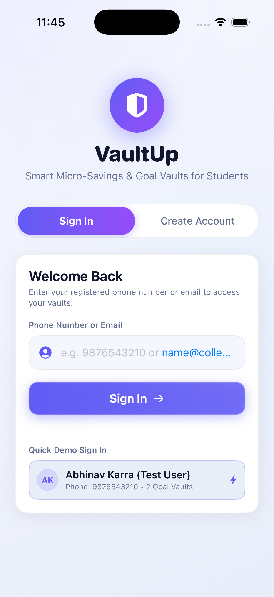
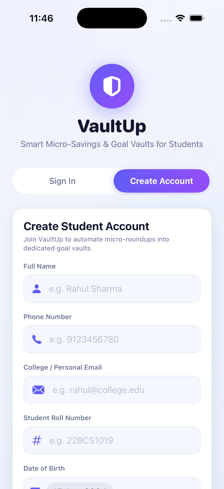
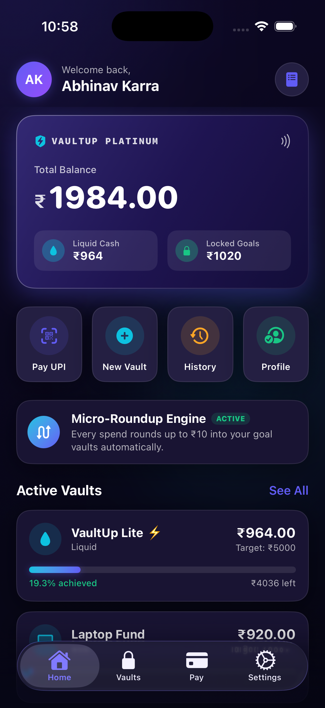
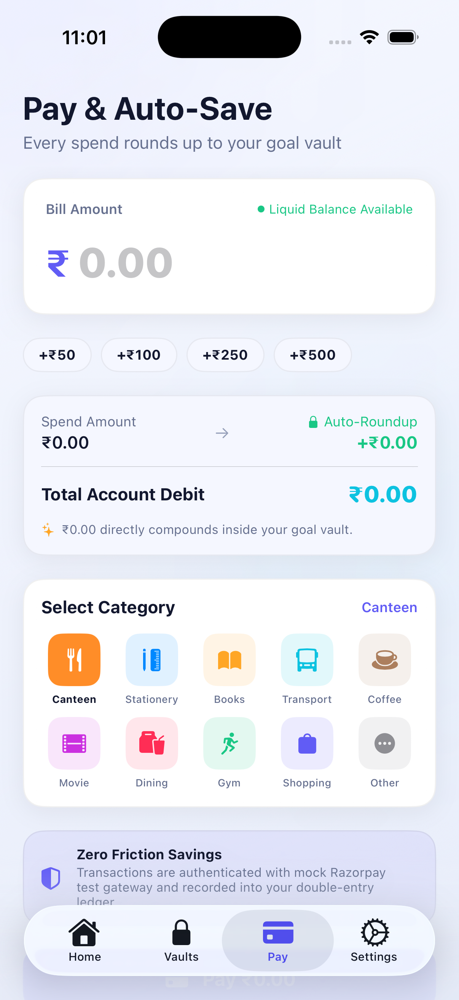
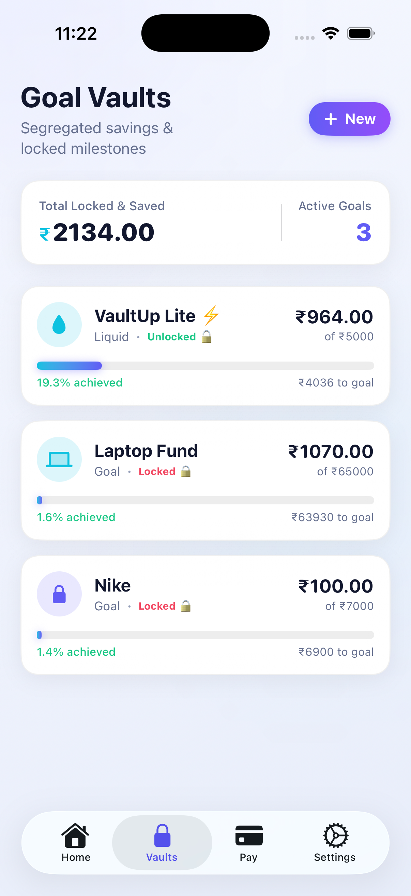
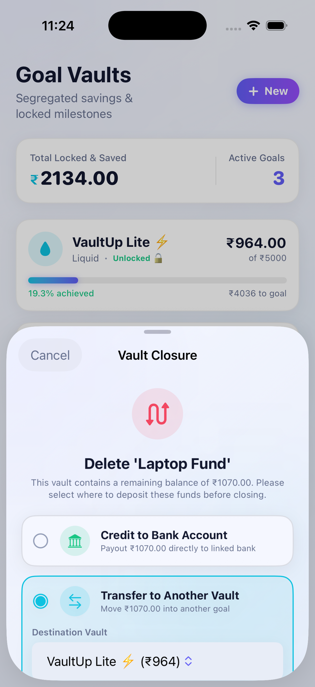
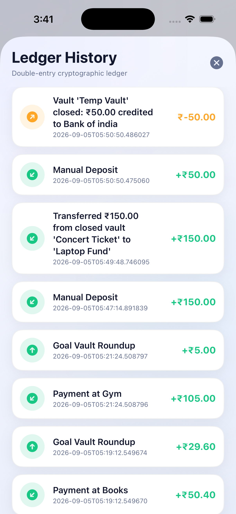
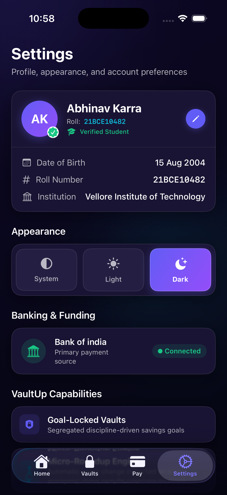

# ⚡️ VaultUp — Smart Micro-Savings & UPI for College Students

<div align="center">

[](ios/)
[](backend/)
[](backend/)
[](backend/)
[](LICENSE)

<p align="center">
  <b>Transforming daily student UPI micro-spends into automated, goal-driven wealth.</b><br>
  Every spend rounds up to the nearest ₹10, depositing spare change silently into protected sub-wallets.
</p>

</div>

---

## 📱 Visual Showcase & App Tour

### 1. Student Authentication & Onboarding Gateway
Seamless authentication experience supporting **1-tap demo sign in** for existing students and comprehensive **student onboarding** (College Email, Student Roll Number, and Date of Birth).

| Sign In Gateway | Student Registration |
| :---: | :---: |
|  |  |
| *1-Tap Demo Access (`9876543210`) & Phone Login* | *Verified Student Onboarding & Linked Bank* |

---

### 2. Apple Wallet-Inspired Fintech Dashboard & UPI Payments
An Apple-standard **Platinum Card** showing real-time total net worth split into **Liquid Cash** and **Locked Goals**, paired with an interactive **Micro-Roundup Engine**.

| Home Dashboard (Liquid vs Goals) | UPI Pay & Micro-Roundup Calculator |
| :---: | :---: |
|  |  |
| *Platinum Card with Liquid Cash vs Locked Goals* | *₹83 spend rounds to ₹90 → ₹7 auto-saved* |

---

### 3. Goal Vaults & Smart Capital Protection
Segregated sub-wallets for targeted student milestones (Laptop, Trips, Gadgets). If a student chooses to delete a vault, VaultUp enforces **Zero-Loss Capital Protection**, allowing them to instantly payout to their linked bank account or reallocate funds to another vault.

| Goal Vaults & Milestone Meters | Vault Closure & Fund Reallocation |
| :---: | :---: |
|  |  |
| *Active goal progress, target metrics, & icons* | *Choice between Bank Credit or Vault Transfer* |

---

### 4. Cryptographic Double-Entry Ledger & Student Profile
Every transaction, payout, and micro-roundup is tracked with immutable debit/credit accounting. Settings include **Institution Verification (B V Raju Institute of Technology)** and a 1-tap **Light/Dark theme switcher**.

| Double-Entry Ledger History | Student Profile & Settings |
| :---: | :---: |
|  |  |
| *Audit trail for roundups, deposits, & transfers* | *Verified profile, Dark/Light modes, & Log Out* |

---

## ✨ Core Features

* ⚡️ **Automated Micro-Roundup Engine**:
  * Every UPI merchant transaction (e.g., ₹83 for campus cafeteria) rounds up to the next ₹10 boundary (₹90).
  * The ₹7 spare change is automatically credited to the student's designated goal vault without cognitive effort.
* 🎯 **Dedicated Sub-Wallets (Goal Vaults)**:
  * Create unlimited goal-based sub-wallets (e.g., `Laptop Fund`, `Nike Shoes`, `Goa Trip Escrow`).
  * Live target progress tracking with completion percentages and milestone projections.
* 🛡️ **Zero-Loss Capital Protection on Vault Deletion**:
  * Vaults containing money cannot be accidentally deleted without choosing a disposition.
  * **Option 1 (Bank Payout)**: Instantly credits remaining funds to the user's primary linked bank account.
  * **Option 2 (Vault Transfer)**: Reallocates the entire balance to another active goal vault.
* 📒 **Double-Entry Accounting Ledger**:
  * Every movement of money is backed by matching debit and credit ledger rows (`ledger_entries`), guaranteeing **zero fund leakage**.
* 🌗 **Dynamic Light & Dark Themes**:
  * Semantic color palette designed for high contrast and elegance in both system light and dark modes.
* 🎓 **Verified Student Profile**:
  * Integrates student roll number, college email detection, and native Date of Birth picker.

---

## 🏗️ Architecture & Technology Stack

```
┌─────────────────────────────────────────────────────────────┐
│                 📱 iOS Client (SwiftUI Native)               │
│   • MVVM Unidirectional Data Flow                           │
│   • NetworkManager (@Published Single Source of Truth)       │
│   • Semantic Theme Engine (Adaptive Light/Dark Modes)       │
│   • UserDefaults Session Management & Root Router           │
└──────────────────────────────┬──────────────────────────────┘
                               │
                        REST API (JSON)
                               │
┌──────────────────────────────▼──────────────────────────────┐
│             ⚙️ Backend API Service (FastAPI / Python)        │
│   • Micro-Roundup Calculation Engine                        │
│   • Sub-Wallet & Goal Lifecycle Controller                  │
│   • Double-Entry Ledger Audit Service                       │
│   • Pydantic Data Contract Validation                       │
└──────────────────────────────┬──────────────────────────────┘
                               │
                        SQLAlchemy ORM
                               │
┌──────────────────────────────▼──────────────────────────────┐
│             💾 Persistence Layer (SQLite Database)          │
│   • users | vaults | transactions | ledger_entries          │
│   • Strict Foreign Key Integrity & Transaction Guarantees   │
└─────────────────────────────────────────────────────────────┘
```

---

## 🚀 Quick Start Guide

### Prerequisites
* **macOS** with **Xcode 15+** installed.
* **Python 3.10+** installed.

### 1. Launch the Backend
```bash
cd backend

# Create and activate a virtual environment
python3 -m venv .venv
source .venv/bin/activate

# Install dependencies
pip install -r requirements.txt

# Start the FastAPI server
python3 -m uvicorn main:app --host 0.0.0.0 --port 8000 --reload
```

Once running, interactive API docs are available at:
* Swagger UI: [http://localhost:8000/docs](http://localhost:8000/docs)
* ReDoc: [http://localhost:8000/redoc](http://localhost:8000/redoc)

### 2. Run the Native iOS Application
1. Open the Xcode project:
   ```bash
   open ios/VaultUp.xcodeproj
   ```
2. Select your preferred iOS Simulator (e.g., **iPhone 17 Pro** or **iPhone 16**).
3. Ensure the backend server is running on `localhost:8000`.
4. Press **⌘R** to build and run the app.

---

## 🧪 Testing the Complete Student Journey

1. **Sign In**: Launch the app and tap the 1-tap demo chip `Demo: 9876543210 (Abhinav Karra)` or enter `9876543210`.
2. **Explore Goals**: Observe active vaults (`Laptop Fund`, `Nike`) with real-time balances.
3. **Simulate a Payment**:
   - Go to the **Pay** tab.
   - Enter an odd amount like `₹83` and select a merchant category (e.g., `Food & Dining`).
   - Notice the live roundup preview showing `₹7.00` spare change auto-saved.
   - Tap **Pay ₹83.00 & Save ₹7.00**.
4. **Inspect Ledger**: Open the top-right History icon on the Home dashboard to verify the double-entry audit entry.
5. **Test Vault Closure**: In the Vaults tab, swipe left on any vault and test the Capital Protection modal.
6. **Log Out & Register New Student**: Go to **Settings** → **Log Out**, then tap **Create Account** to test new student onboarding.

---

## 📂 Repository Structure

```
VaultUP/
├── backend/
│   ├── main.py                    # FastAPI endpoints (Auth, Vaults, Payments, Ledger)
│   ├── models.py                  # SQLAlchemy ORM database models
│   ├── vaultup.db                 # SQLite database
│   ├── test_payment_system.py     # Automated backend test suite
│   └── requirements.txt           # Python dependencies
├── ios/
│   └── VaultUp/
│       ├── VaultUpApp.swift       # App lifecycle & conditional root navigation
│       ├── AuthView.swift         # Authentication gateway (Sign In & Student Sign Up)
│       ├── HomeView.swift         # Dashboard, Platinum card, & micro-roundup banner
│       ├── VaultsView.swift       # Goal vaults list, creation sheet, & swipe actions
│       ├── VaultDetailView.swift  # Vault milestone progress & close/delete action
│       ├── PaymentView.swift      # UPI checkout & live spare change calculator
│       ├── SettingsView.swift     # Student profile, theme switcher, & log out
│       ├── TransactionHistoryView.swift # Double-entry ledger audit sheet
│       ├── NetworkManager.swift   # Async API client & reactive state container
│       ├── Models.swift           # Swift data models
│       └── Theme.swift            # Adaptive Light & Dark mode design system
└── docs/
    └── screenshots/               # High-resolution application screenshots
```

---

## 📄 License
This project is licensed under the [MIT License](LICENSE).
